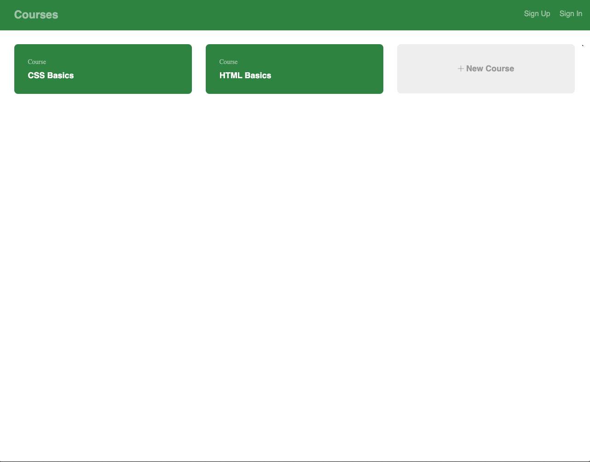
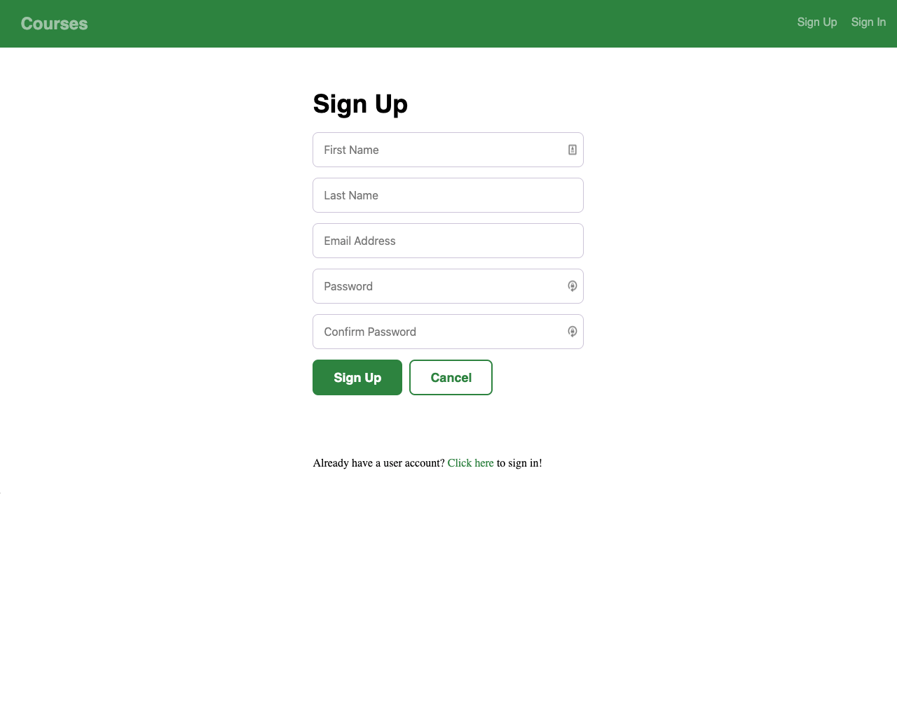
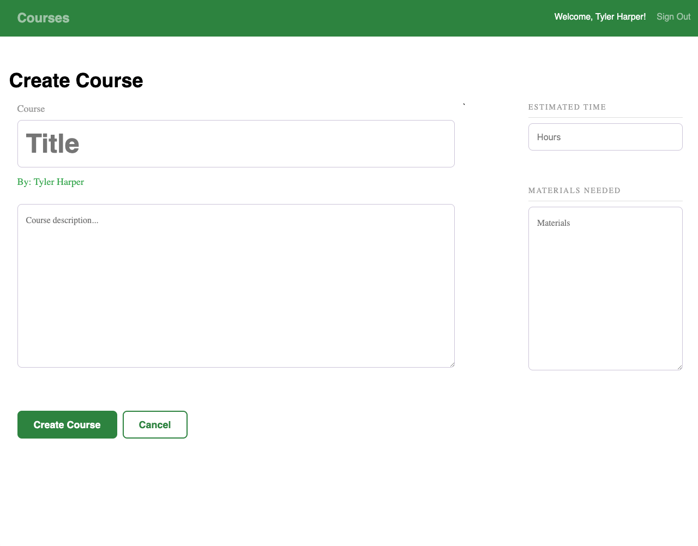
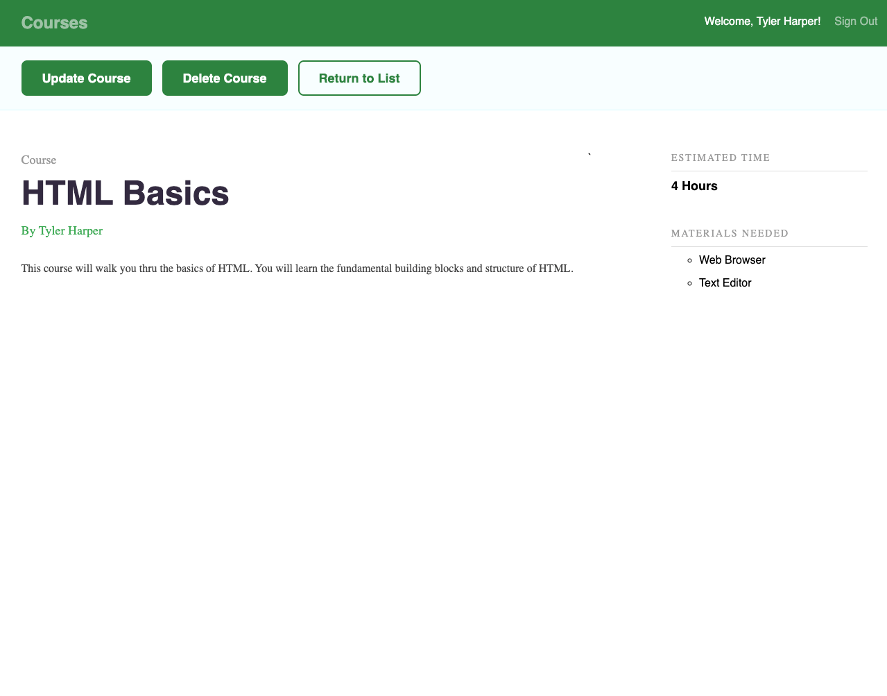
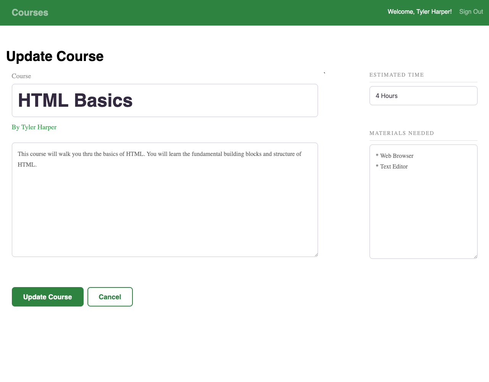

## Courses FullStack React App

### Unit 10 Project

This is a project that uses React for the Frontend and Express for the backend. This project is the Visual Layer (frontend) of the previous REST API created in my Unit 9 Project. This application is a Fullstack web application demonstrating React Routing, Client Login, and the CRUD operations that need to be available in a FullStack application.

[View Project](https://courses.jsstack.dev/)

[Project Files](https://github.com/tylerdh12/Course_App)

#### Technologies

    * JSX
    * CSS
    * JavaScript
    * React
    * JS-Cookies

