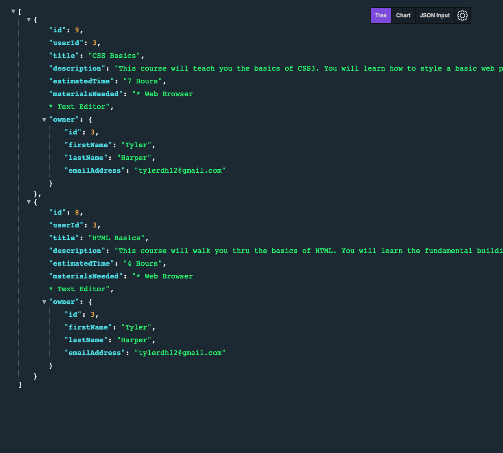
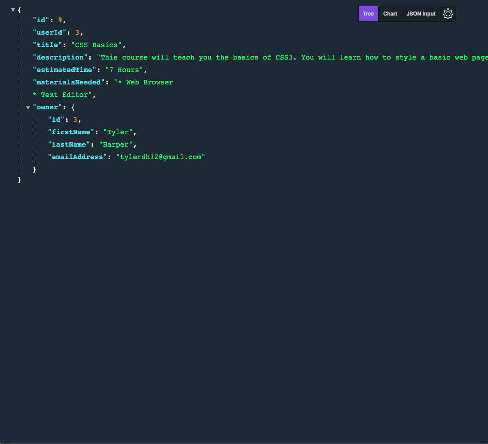

## Courses REST API

### Unit 9 Project

This is a project that uses Express and Node to create a Backend for a Courses
application that will have User Auth and will show courses with CRUD function.

[View Project](https://courses-pro.herokuapp.com/)

[Project Files](https://github.com/tylerdh12/Course_API)

#### Technologies

    * HTML
    * CSS
    * JavaScript
    * Express
    * Sequelize ORM

