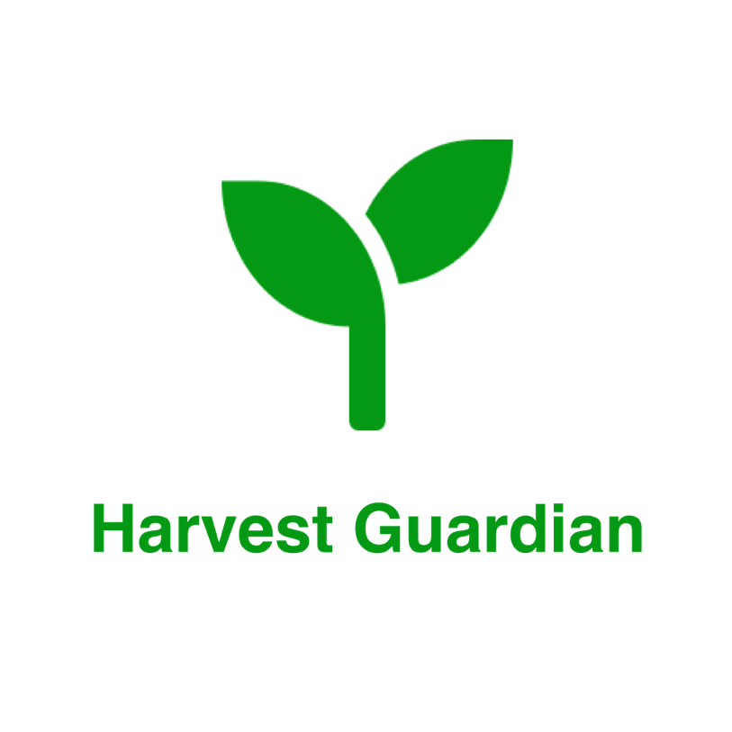
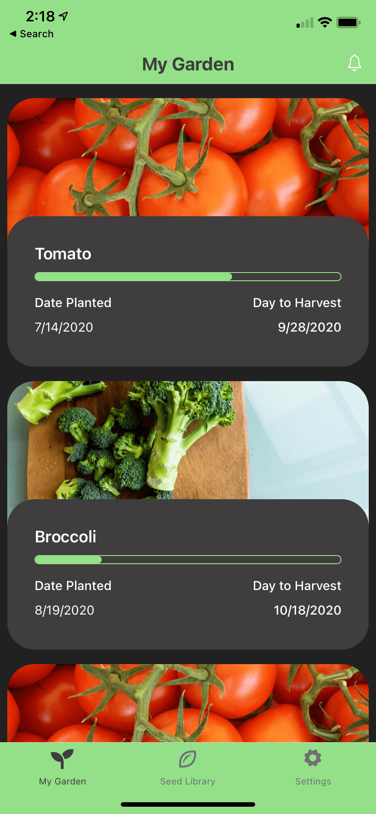
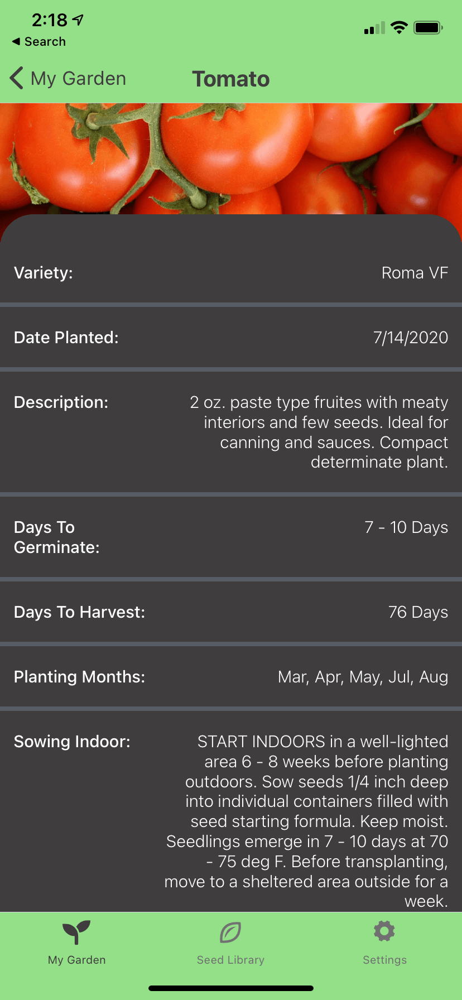
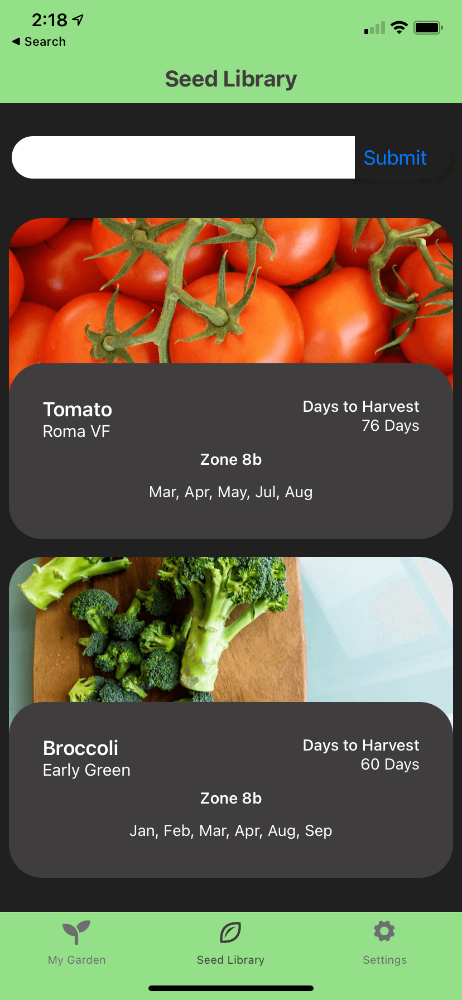
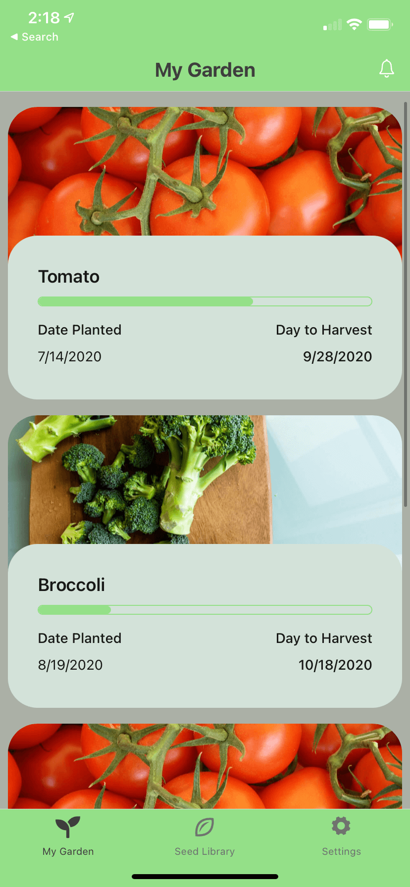
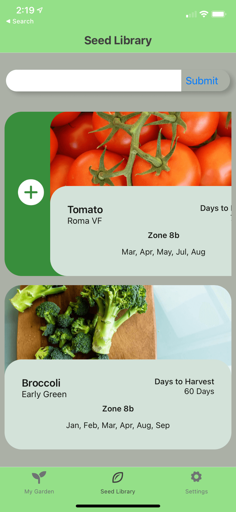
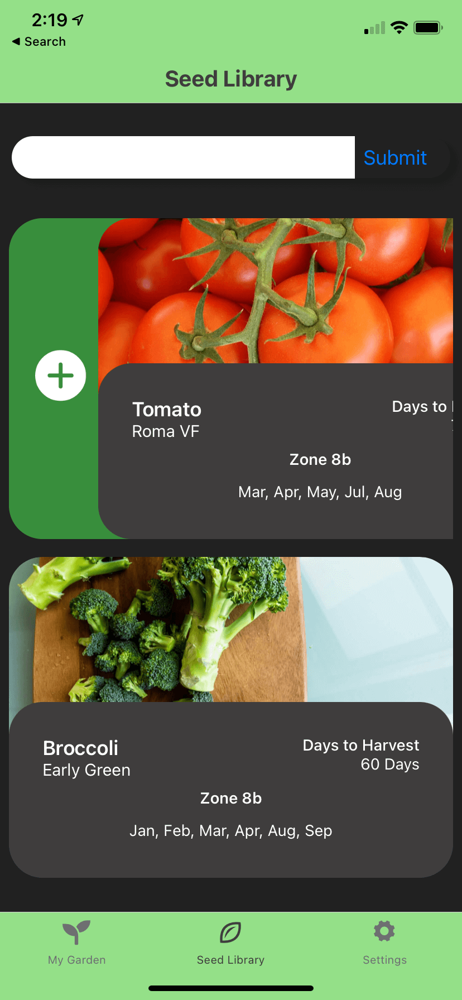
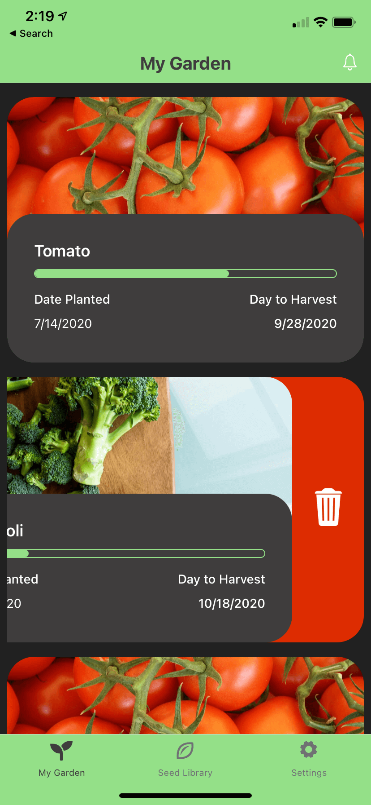

## Harvest Guardian App

Gardening app to help keep track of your plants.

[View Project](https://expo.io/@tylerdh12/Harvest_Guardian)

[Project Files](https://github.com/tylerdh12/Harvest-Guardian)

#### Technologies

    * Expo
    * Custom REST Api
    * React Native
    * StyledComponents
    * TypeScript
    * MongoDB
    * Mongoose

