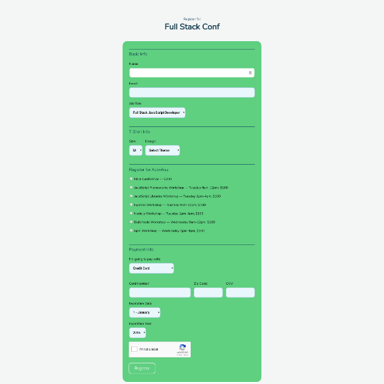
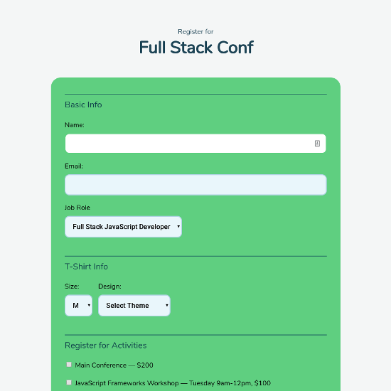

## Interactive Form

### Unit 3 Project

This app displays random quotes each time a button is clicked or a certain timeout has passed.

[View Project](https://interactiveform.jsstack.dev/)

[Project Files](https://github.com/tylerdh12/TeamTreehouse-Interactive_Form-Unit_3_Project)

#### Technologies

    * HTML
    * CSS
    * JavaScript

