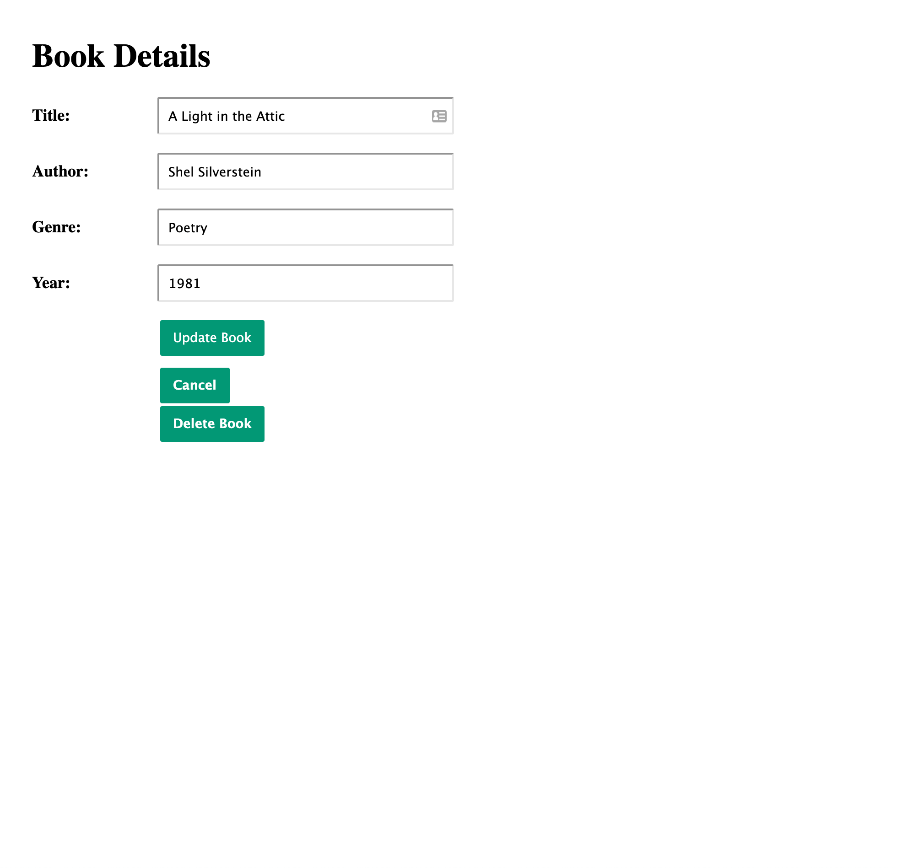

## Library Management Console

### Unit 8 Project

This is a project that uses pug design template design, and express for the back end.

[View Project](https://library-manager-pro.herokuapp.com/)

[Project Files](https://github.com/tylerdh12/Project-8-Treehouse-FSJ)

#### Technologies

    * HTML
    * CSS
    * JavaScript
    * PUG
    * Express

