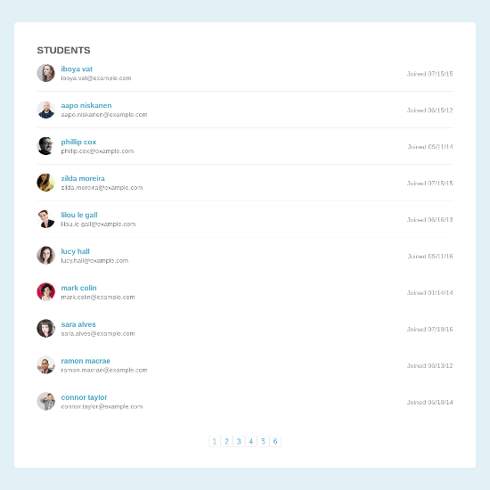
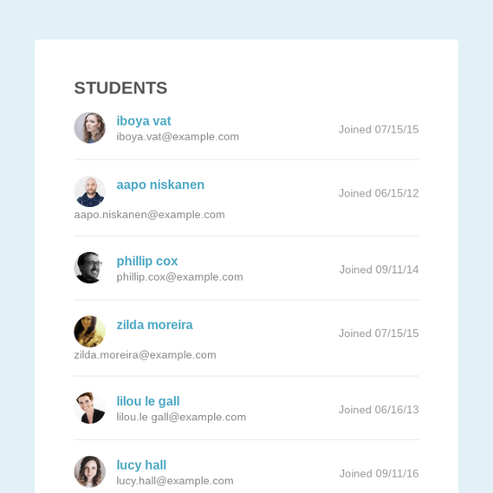

## List Pagination and Filtering

### Unit 2 Project

This app displays random quotes each time a button is clicked or a certain timeout has passed.

[View Project](https://pagination.jsstack.dev/)

[Project Files](https://github.com/tylerdh12/TeamTreehouse-List_Pagination_and_Filtering-Unit-2-Project)

#### Technologies

    * HTML
    * CSS
    * JavaScript

