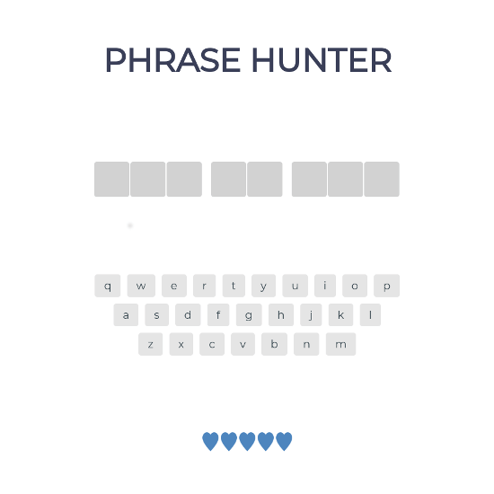
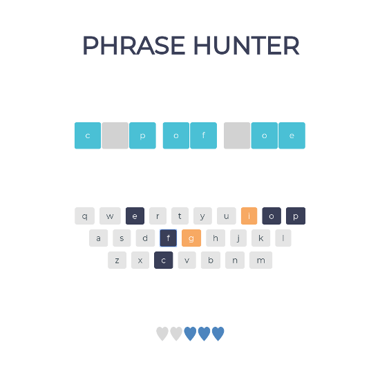

## Phrase Hunter Game Show

### Unit 4 Project

This app is a game that is based on 'hangman'. It uses Object-Oriented Programming and uses class functions to hold game state. New games generate a new phrase for each game.

[View Project](https://gameshow.jsstack.dev/)

[Project Files](https://github.com/tylerdh12/TeamTreehouse-OOP_Game_Show_App-Unit_4_Project)

#### Technologies

    * HTML
    * CSS
    * JavaScript

