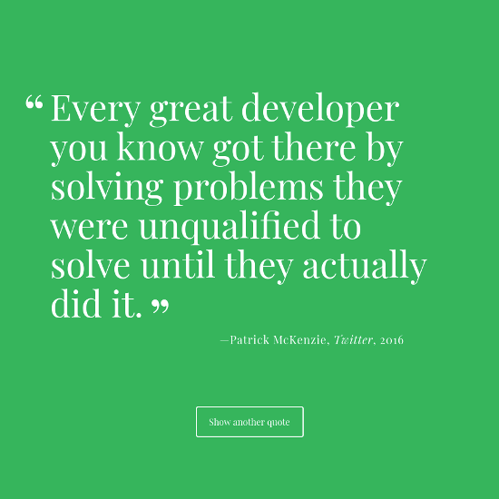
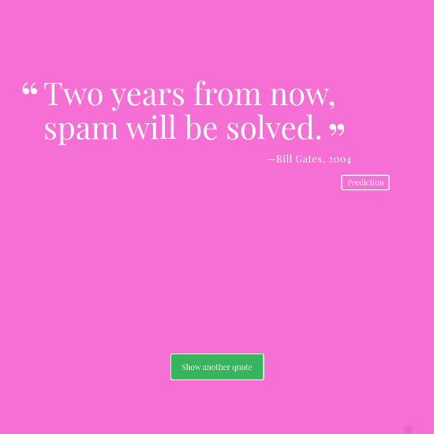

## Random Quotes Generator

### Unit 1 Project

This app displays random quotes each time a button is clicked or a certain timeout has passed.

[View Project](https://random-quotes.jsstack.dev/)

[Project Files](https://github.com/tylerdh12/TeamTreehouse-Random_Quotes_Generator-Unit-1-Project)

#### Technologies

    * HTML
    * CSS
    * JavaScript

