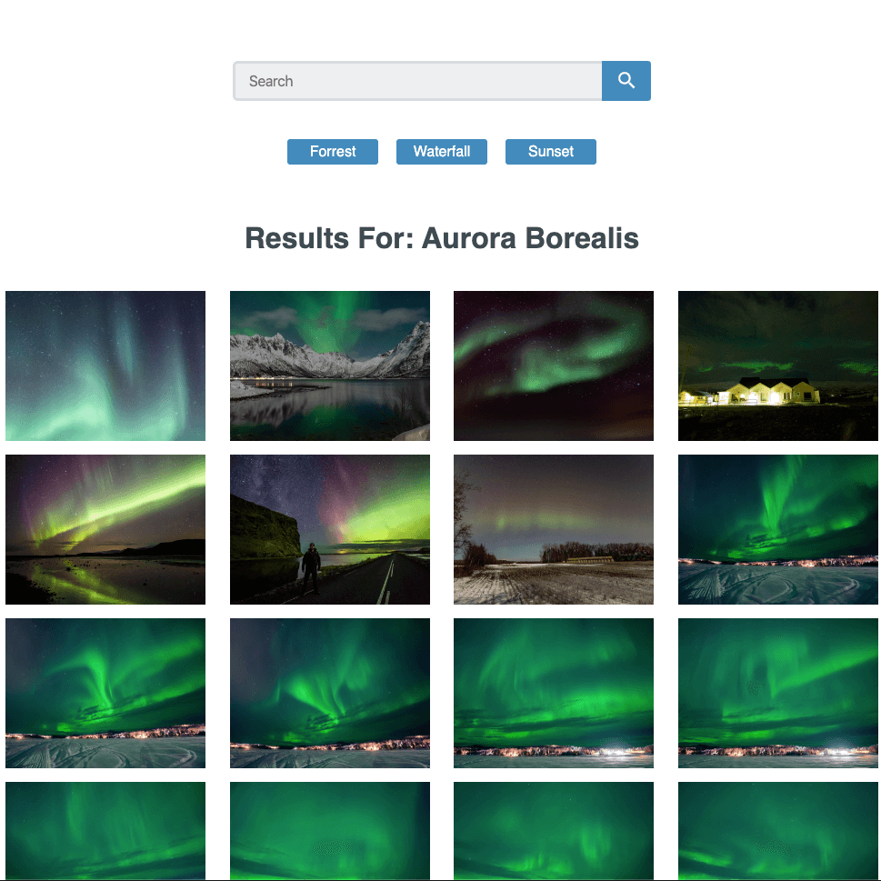
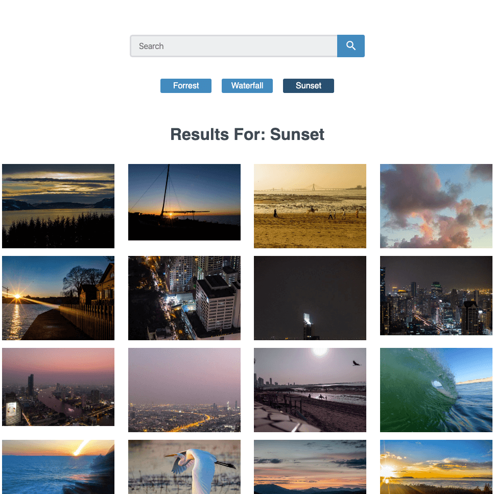

## React App using Flickr API

### Unit 7 Project

This is a project that uses the Flickr API and React as the framework

[View Project](https://flickr.jsstack.dev/)

[Project Files](https://github.com/tylerdh12/Project-7-TeamTreehouse-FSJ)

#### Technologies

    * JSX
    * CSS
    * JavaScript
    * React

