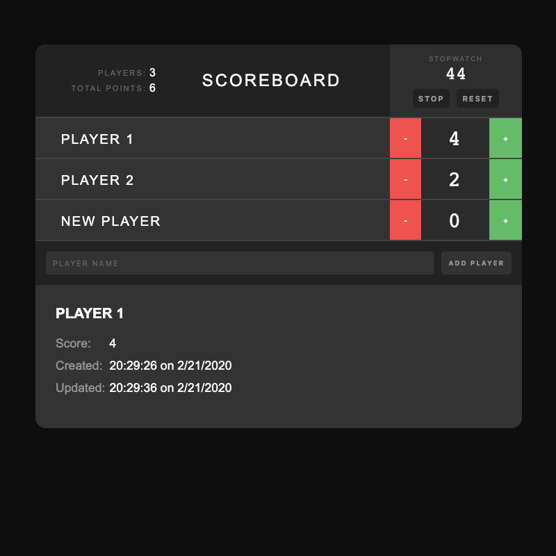
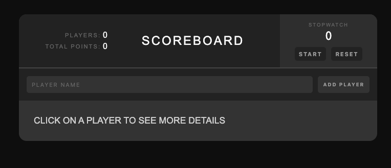

## Scoreboard

### Redux Project

This is a project that uses React with Redux for state.

[View Project](https://scoreboard.jsstack.dev/)

[Project Files](https://github.com/tylerdh12/FSJS-Scoreboard)

#### Technologies

    * JSX
    * CSS
    * JavaScript
    * React
    * Redux

